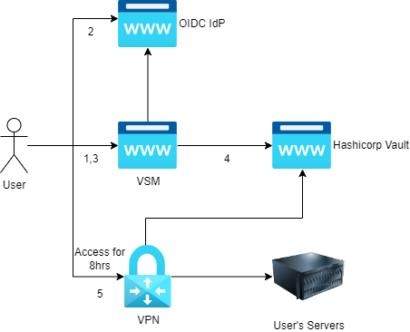

# VPN Server Manager
## Badges

## What is this?
This project aims to provide a system to allow self-serve, short lived VPN access for users I host servers for. The diagram below illustrates the flow of information.

1. Users reach the VSM portal
2. When hitting the login button, they get redirected to an OIDC Identity Provider (IdP)
3. Upon successful login, the user is prompted to select a VPN configuration from a list of allowed VPN endpoints.
4. VSM asks a Hashicorp Vault backend to generate a certificate for the appropriate VPN configuration, pulls the VPN config metadata from the same vault, generates the vpn configuration file, returns the generated ovpn file to the user.
5. Once the user has retrieved the config, they can now initiate their VPN connection and access their servers.

## How to deploy?
Download a copy of the `docker-compose.yml` file from this repository, tweak it to what you need. The docker-compose.yml is set to deploy a local development copy of the whole stack (Vault, Keycloak, Redis, VSM and HAProxy). 

`*.local.kronus.network` is already set to `127.0.0.1` in the global DNS, thus the default mapping is as follows:
- kc.local.kronus.network => Keycloak
- hcv.local.kronus.network => Hashicorp Vault
- vsm.local.kronus.network => VPN Server Manager

rule of thumbs
- the folder `/home/vsm/config/vsm` contains the `vpn_group_mapping.json` and `app.json` files needed to configure VSM itself. In K8s this can be a configmap
- the folder `/home/vsm/config/haproxy` contains the HAProxy configuration file needed for development purposes.
- the folder `/home/vsm/static` contains a single file called `logo.png` which can be overridden
- the folder `/home/vsm/templates` containes the templates used to render the site. `index.html` is the file loaded by the app. `template.ovpn` contains the VPN configuration template file that gets rendered with the given parameters. You shouldn't need to change it as the vpnmetadata is pulled from vault.